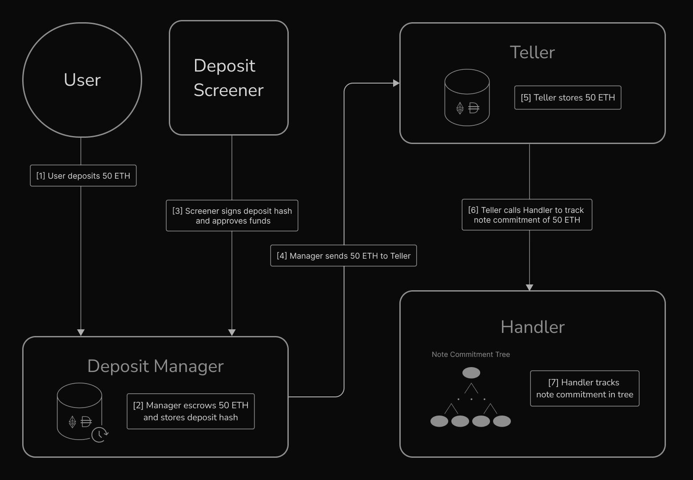

  

  

  

### Introducing Specter

For crypto to reach its next stage of growth, it must be used less as a means of speculation and evolve to become more like money—a reliable medium of exchange and store of wealth. If crypto is to reach a more money-like state, privacy is not just a nice-to-have. Everyone should be able to receive payroll on-chain without revealing their salaries, make purchases without divulging spending habits, and store their assets on-chain without disclosing their net worth.

Despite the necessity, privacy adoption remains an unsolved problem. While the design space of mixers, alternative chains, and semi-composable roll-ups have been explored, privacy still remains a fringe category. To tackle this issue, we see two paths toward adoption: address the unmet needs of the privacy-conscious and integrate privacy into existing applications for the average user.

### Our Approach

Specter is a highly composable protocol for private accounts on Ethereum. Using a mix of account abstraction and zero-knowledge proofs, we’ve built a private account layer that enables users to send, receive, and transact with their funds, all without exposing their address (check out our Litepaper v1 to see how it works). It is designed as a generic system upon which end-user products can be easily built. Given this flexibility, we can cater to both the privacy maximalist as well as the traditional user.

Protocol flow example: Swapping ETH for DAI

### Private Vault

The simplest application we can build on Specter is a private vault that lets you store your assets long-term, earn yield on idle assets, and withdraw to burner wallets for high-touch activities like trading, all without exposing your address or net balances. This product addresses the privacy-conscious and is what we have in store for V1.

### Backend for Private Payments

Instead of making payments directly to a recipient's EOA and exposing their financial history, one can simply send funds into Specter and set their owner to the recipient’s stealth address. There is already demand for this today in payroll for on-chain organizations—people don’t want the whole world to know their salary. By integrating Specter into existing DAO payment products, if you are a company administrator, keeping your employees’ salaries private will be as simple as clicking a button.

### Privacy-Preserving Smart Contract Wallet

Broader retail adoption of privacy hinges on seamless integration into the existing wallet experience. The Specter SDK can be integrated into existing wallets to enable a standard wallet experience with built-in asset privacy. In fact, the first iteration of our product does this to a limited extent by integrating our SDK into a MetaMask Snap, allowing users to interact with Specter applications using MetaMask. Taking this several steps further, we can, in theory, build a wallet that lets users transact as they normally do with asset-privacy invisibly worked into their on-chain interactions.

### Integration with Tor

  

Privacy-conscious users often rely on Tor to anonymize their internet traffic. Integrating Tor into the Specter protocol enhances user privacy by routing network communications through the Tor network. Similar to how Bisq utilizes Tor for anonymizing trade data, Specter aims to offer a seamless and secure experience for users who prioritize privacy. This integration ensures that users can interact with the protocol without revealing their IP addresses, providing an additional layer of anonymity and security.

### Compliance

The protocol is designed to evolve with the ever-changing landscape of the crypto industry. To protect our users and build a lasting solution, we build in address screening and rate limits at the deposit step for compliance. There is no custody risk—the protocol is permissionless once funds are deposited.

